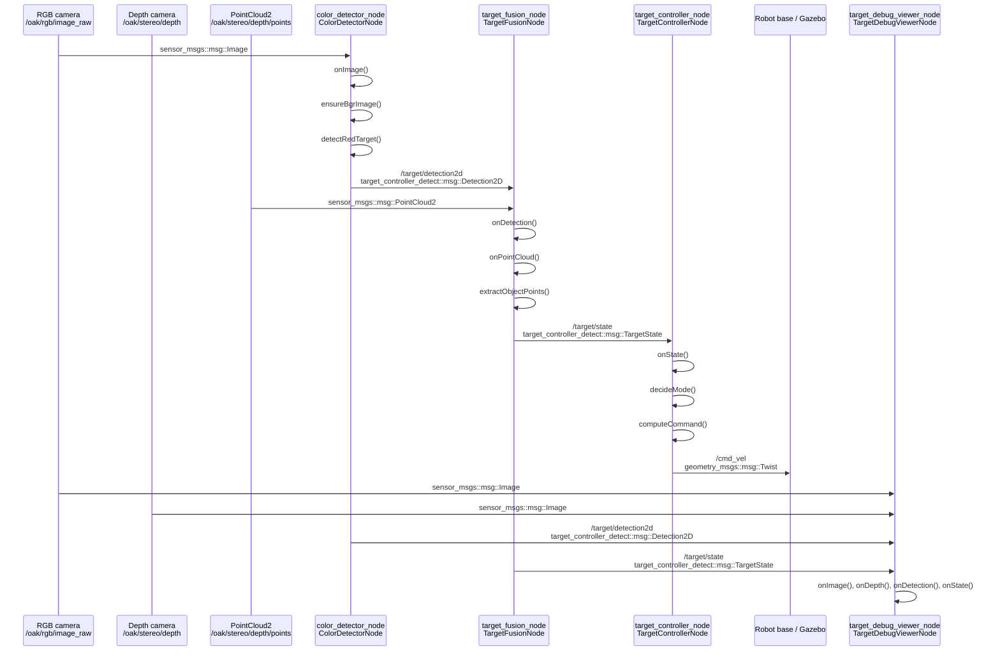

# Последовательность передачи данных `target_controller_detect`

```mermaid
sequenceDiagram
    participant RGB as RGB camera<br/>/oak/rgb/image_raw
    participant Depth as Depth camera<br/>/oak/stereo/depth
    participant Cloud as PointCloud2<br/>/oak/stereo/depth/points
    participant Detector as color_detector_node<br/>ColorDetectorNode
    participant Fusion as target_fusion_node<br/>TargetFusionNode
    participant Controller as target_controller_node<br/>TargetControllerNode
    participant Robot as Robot base / Gazebo
    participant Debug as target_debug_viewer_node<br/>TargetDebugViewerNode

    RGB->>Detector: sensor_msgs::msg::Image
    Detector->>Detector: onImage()
    Detector->>Detector: ensureBgrImage()
    Detector->>Detector: detectRedTarget()
    Detector->>Fusion: /target/detection2d<br/>target_controller_detect::msg::Detection2D

    Cloud->>Fusion: sensor_msgs::msg::PointCloud2
    Fusion->>Fusion: onDetection()
    Fusion->>Fusion: onPointCloud()
    Fusion->>Fusion: extractObjectPoints()
    Fusion->>Controller: /target/state<br/>target_controller_detect::msg::TargetState

    Controller->>Controller: onState()
    Controller->>Controller: decideMode()
    Controller->>Controller: computeCommand()
    Controller->>Robot: /cmd_vel<br/>geometry_msgs::msg::Twist

    RGB->>Debug: sensor_msgs::msg::Image
    Depth->>Debug: sensor_msgs::msg::Image
    Detector->>Debug: /target/detection2d<br/>target_controller_detect::msg::Detection2D
    Fusion->>Debug: /target/state<br/>target_controller_detect::msg::TargetState
    Debug->>Debug: onImage(), onDepth(), onDetection(), onState()
```

