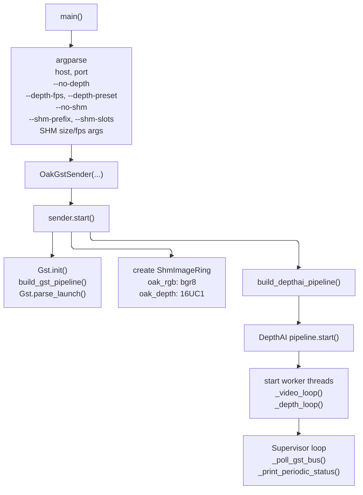
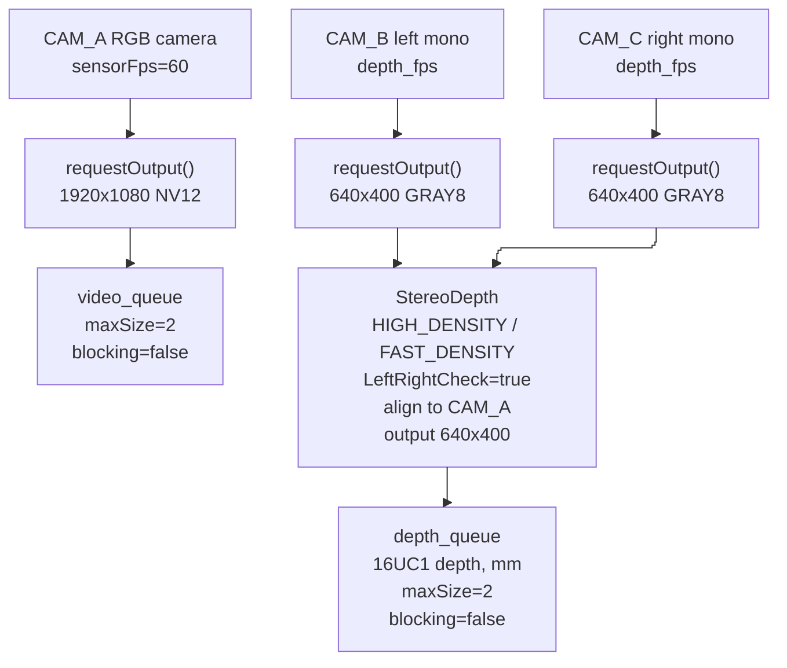
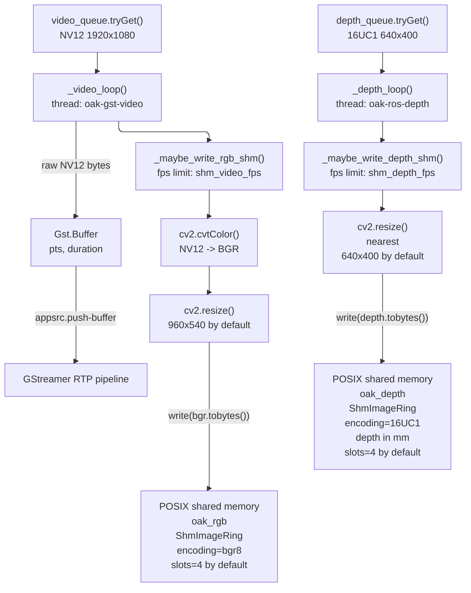
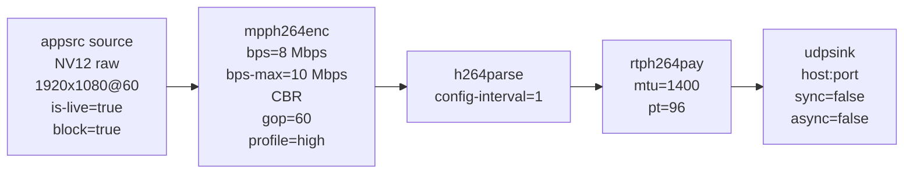
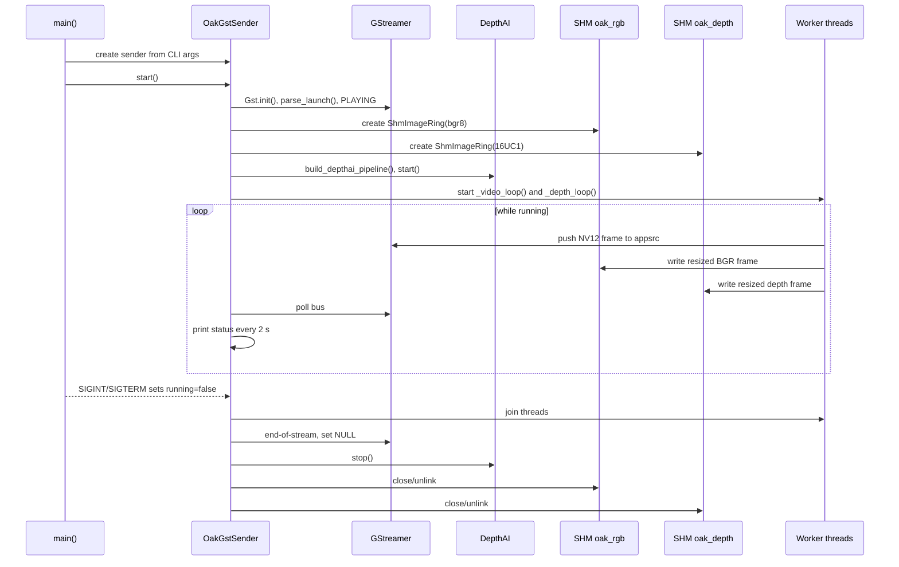

# Структурная схема `oak_gst_sender_publish_boost_1.py`

## Общая структура

## DepthAI pipeline

## Рабочие потоки и передача данных

## GStreamer pipeline

## Жизненный цикл

## Основные отличия варианта `_boost_1`

- ROS2-публикация `/oak/rgb/image_raw` и `/oak/stereo/depth` удалена из sender.
- RGB в GStreamer остается исходным `NV12 1920x1080@60`, а RGB в shared memory пишется отдельно как `bgr8`, по умолчанию `960x540@15`.
- Depth пишется в shared memory как `16UC1`, по умолчанию `640x400@15`.
- Два SHM-сегмента создаются по префиксу: `oak_rgb` и `oak_depth`.
- Контроль частоты SHM вынесен в `_maybe_write_rgb_shm()` и `_maybe_write_depth_shm()`.

