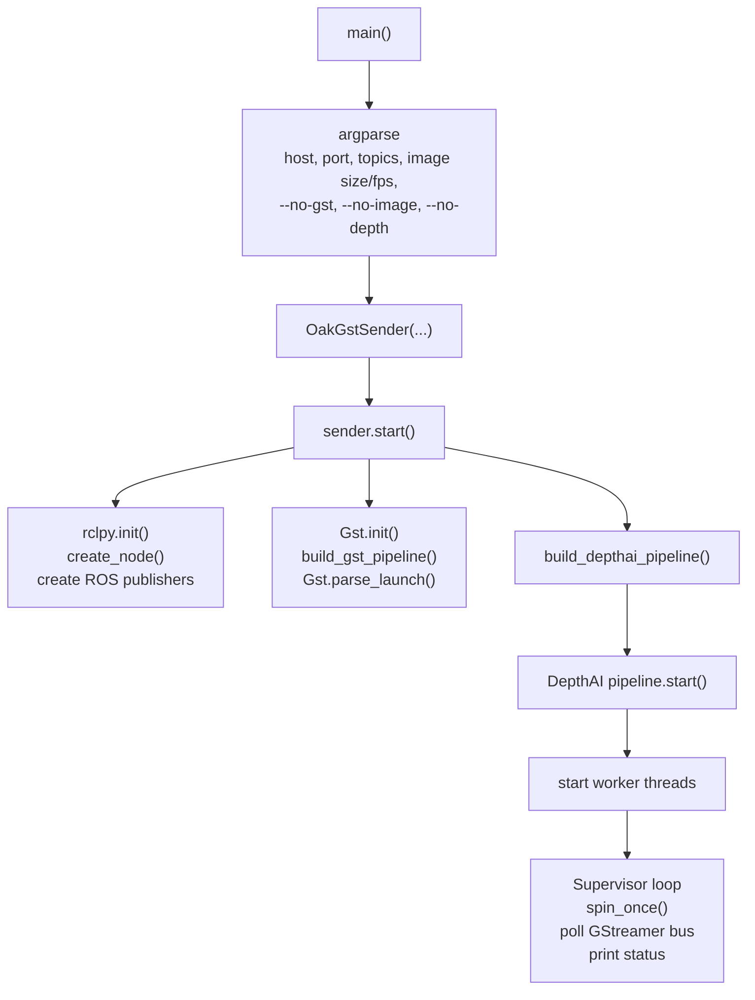
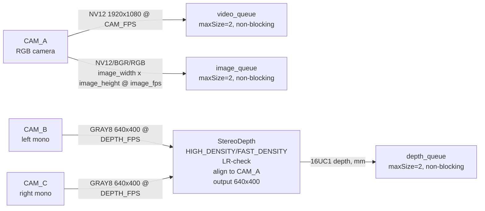
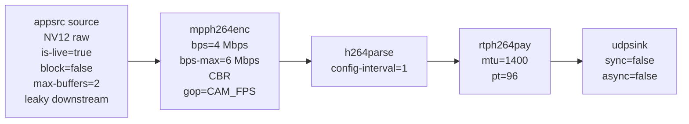
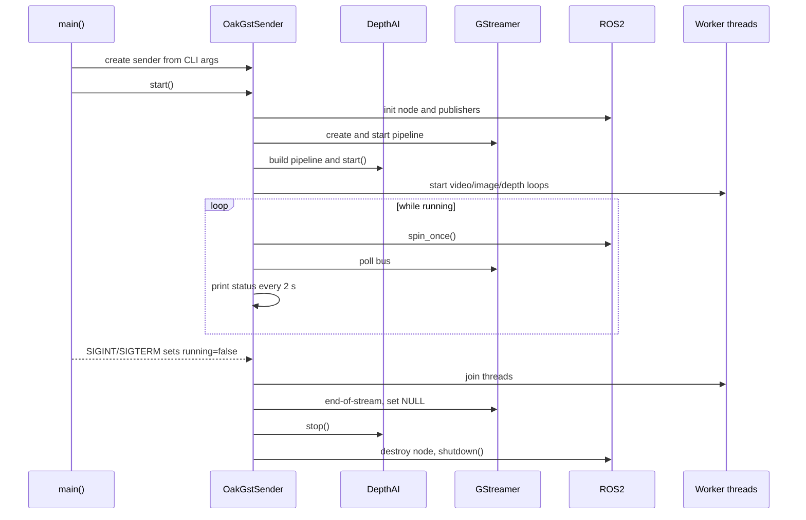

# Структурная схема `oak_gst_sender_publish_test.py`

## Общая структура

## DepthAI pipeline

## Рабочие потоки

```mermaid
flowchart TD
    VIDEO_THREAD["_video_loop()\noak-gst-video"]
    IMAGE_THREAD["_image_loop()\noak-ros-image"]
    DEPTH_THREAD["_depth_loop()\noak-ros-depth"]
    SUPERVISOR["start() supervisor loop"]

    VIDEO_Q["video_queue.tryGet()"] --> VIDEO_THREAD
    IMAGE_Q["image_queue.tryGet()"] --> IMAGE_THREAD
    DEPTH_Q["depth_queue.tryGet()"] --> DEPTH_THREAD

    VIDEO_THREAD -->|"bytes(frame.getData())"| GST_BUF["Gst.Buffer\npts, duration"]
    GST_BUF -->|"appsrc.push-buffer"| GST_PIPE["GStreamer pipeline"]
    GST_PIPE --> ENC["mpph264enc\nRockchip HW H.264"]
    ENC --> RTP["h264parse\nrtph264pay"]
    RTP --> UDP["udpsink\nhost:port"]

    IMAGE_THREAD --> BUILD_IMG["build_image_msg()"]
    BUILD_IMG -->|"NV12 source"| NV12_BGR["nv12_to_bgr_bytes()\ncv2.cvtColor if available\nnumpy fallback"]
    BUILD_IMG --> ROS_RGB["ROS Image publisher\n/oak/rgb/image_raw\nencoding=bgr8/rgb8"]

    DEPTH_THREAD --> BUILD_DEPTH["build_depth_msg()"]
    BUILD_DEPTH --> ROS_DEPTH["ROS Image publisher\n/oak/stereo/depth\nencoding=16UC1"]

    SUPERVISOR --> SPIN["rclpy.spin_once(timeout=0)"]
    SUPERVISOR --> BUS["_poll_gst_bus()\nERROR/WARNING/EOS"]
    SUPERVISOR --> STATUS["_print_periodic_status()\ngst/rgb/depth fps"]
```

## GStreamer pipeline

## Жизненный цикл

## Назначение основных функций

- `build_depthai_pipeline()` создает камеры, выходные очереди RGB/video/depth и узел `StereoDepth`.
- `build_gst_pipeline()` собирает строку GStreamer для аппаратного H.264 и RTP/UDP отправки.
- `_video_loop()` обслуживает самый критичный путь: `video_queue -> appsrc -> RTP/UDP`.
- `_image_loop()` публикует цветной ROS `sensor_msgs/Image`; при NV12 конвертирует в BGR.
- `_depth_loop()` публикует depth ROS `sensor_msgs/Image` в формате `16UC1`.
- `_poll_gst_bus()` ловит ошибки, предупреждения и EOS из GStreamer.
- `stop()` останавливает потоки, GStreamer, DepthAI и ROS.

## Где возможны задержки

- `build_image_msg()` копирует кадр и может делать NV12->BGR конвертацию.
- `build_depth_msg()` копирует depth buffer перед публикацией.
- `publish()` сериализует большие `sensor_msgs/Image`.
- `StereoDepth` и дополнительные `requestOutput()` могут снижать пропускную способность внутри OAK/DepthAI даже при низкой CPU-нагрузке на одноплатнике.
