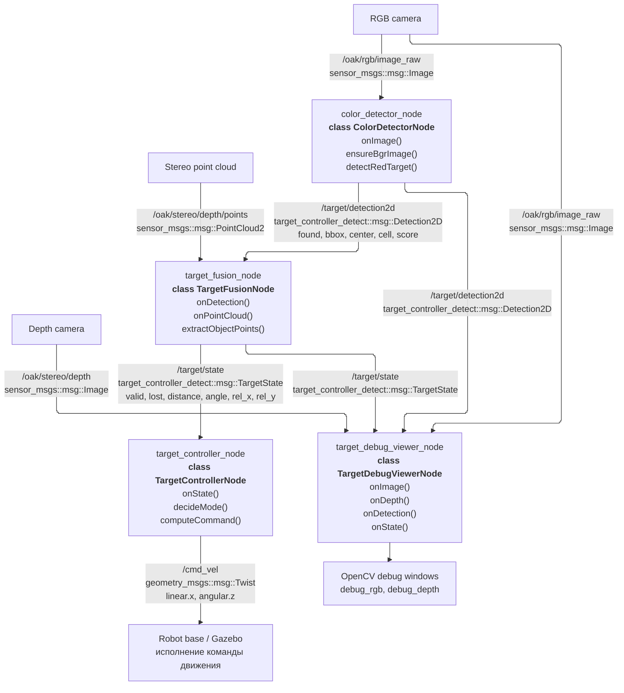

# Укрупненная схема нод `target_controller_detect`

```mermaid
%%{init: {"flowchart": {"defaultRenderer": "elk", "curve": "step"}} }%%
flowchart TD
    RGB_SOURCE["RGB camera"]
    DEPTH_SOURCE["Depth camera"]
    CLOUD_SOURCE["Stereo point cloud"]

    DETECTOR["color_detector_node<br/><b>class ColorDetectorNode</b><br/>onImage()<br/>ensureBgrImage()<br/>detectRedTarget()"]

    FUSION["target_fusion_node<br/><b>class TargetFusionNode</b><br/>onDetection()<br/>onPointCloud()<br/>extractObjectPoints()"]

    CONTROLLER["target_controller_node<br/><b>class TargetControllerNode</b><br/>onState()<br/>decideMode()<br/>computeCommand()"]

    ROBOT["Robot base / Gazebo<br/>исполнение команды движения"]

    DEBUG["target_debug_viewer_node<br/><b>class TargetDebugViewerNode</b><br/>onImage()<br/>onDepth()<br/>onDetection()<br/>onState()"]
    DEBUG_WINDOWS["OpenCV debug windows<br/>debug_rgb, debug_depth"]

    RGB_SOURCE -->|"/oak/rgb/image_raw<br/>sensor_msgs::msg::Image"| DETECTOR
    DETECTOR -->|"/target/detection2d<br/>target_controller_detect::msg::Detection2D<br/>found, bbox, center, cell, score"| FUSION
    CLOUD_SOURCE -->|"/oak/stereo/depth/points<br/>sensor_msgs::msg::PointCloud2"| FUSION
    FUSION -->|"/target/state<br/>target_controller_detect::msg::TargetState<br/>valid, lost, distance, angle, rel_x, rel_y"| CONTROLLER
    CONTROLLER -->|"/cmd_vel<br/>geometry_msgs::msg::Twist<br/>linear.x, angular.z"| ROBOT

    RGB_SOURCE -->|"/oak/rgb/image_raw<br/>sensor_msgs::msg::Image"| DEBUG
    DEPTH_SOURCE -->|"/oak/stereo/depth<br/>sensor_msgs::msg::Image"| DEBUG
    DETECTOR -->|"/target/detection2d<br/>target_controller_detect::msg::Detection2D"| DEBUG
    FUSION -->|"/target/state<br/>target_controller_detect::msg::TargetState"| DEBUG
    DEBUG --> DEBUG_WINDOWS
```
