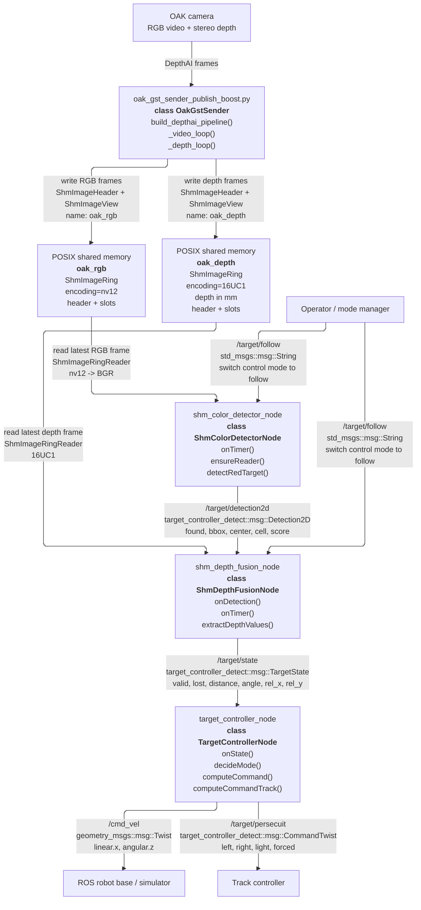
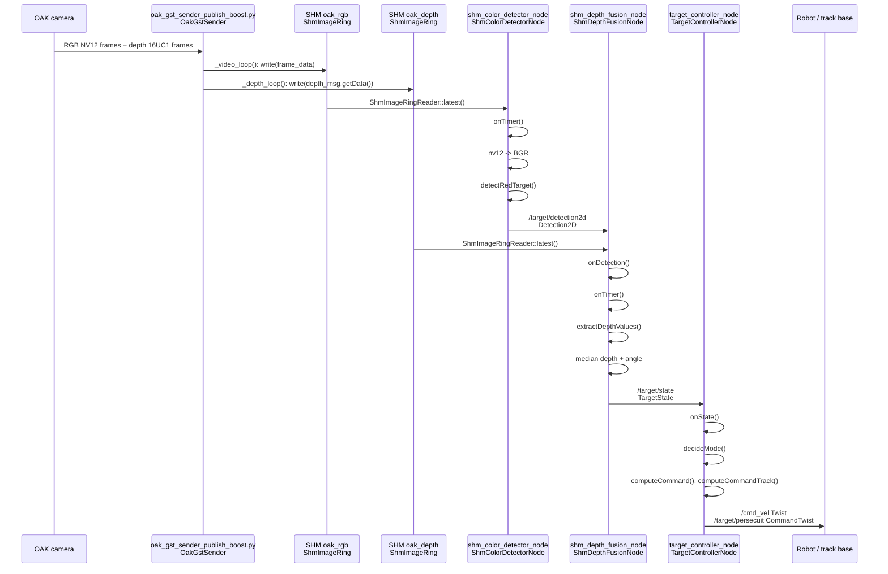

# Схема `target_controller_detect` с передачей RGB и depth через shared memory

## Последовательность обработки

## Что изменилось относительно ROS Image pipeline

- RGB-кадр читается `shm_color_detector_node` из сегмента общей памяти `oak_rgb`, а не из топика `/oak/rgb/image_raw`.
- Depth читается `shm_depth_fusion_node` из сегмента `oak_depth`, а не из `/oak/stereo/depth` или `PointCloud2`.
- Между детектором, fusion и контроллером остаются обычные ROS2-сообщения: `Detection2D`, `TargetState`, `Twist`, `CommandTwist`.
- Обработка включается только в режиме follow: обе SHM-ноды слушают `/target/follow` типа `std_msgs::msg::String`.

