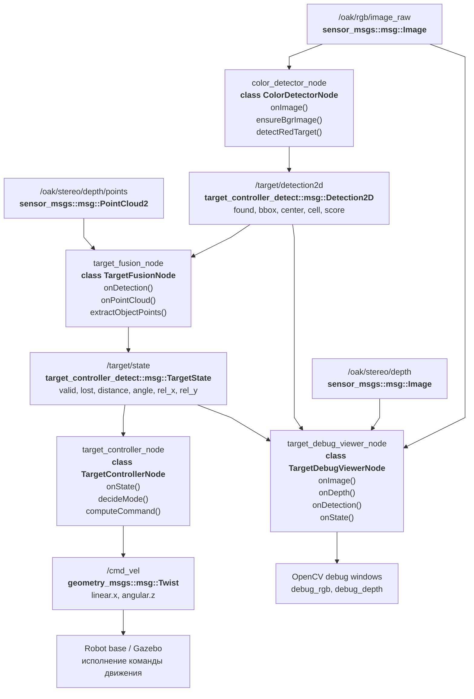

# Укрупненная схема нод `target_controller_detect`

```mermaid
%%{init: {"flowchart": {"curve": "linear"}} }%%
flowchart TD
    RGB_TOPIC["/oak/rgb/image_raw<br/><b>sensor_msgs::msg::Image</b>"]
    DEPTH_TOPIC["/oak/stereo/depth<br/><b>sensor_msgs::msg::Image</b>"]
    CLOUD_TOPIC["/oak/stereo/depth/points<br/><b>sensor_msgs::msg::PointCloud2</b>"]

    DETECTOR["color_detector_node<br/><b>class ColorDetectorNode</b><br/>onImage()<br/>ensureBgrImage()<br/>detectRedTarget()"]
    DETECTION_MSG["/target/detection2d<br/><b>target_controller_detect::msg::Detection2D</b><br/>found, bbox, center, cell, score"]

    FUSION["target_fusion_node<br/><b>class TargetFusionNode</b><br/>onDetection()<br/>onPointCloud()<br/>extractObjectPoints()"]
    STATE_MSG["/target/state<br/><b>target_controller_detect::msg::TargetState</b><br/>valid, lost, distance, angle, rel_x, rel_y"]

    CONTROLLER["target_controller_node<br/><b>class TargetControllerNode</b><br/>onState()<br/>decideMode()<br/>computeCommand()"]
    CMD_MSG["/cmd_vel<br/><b>geometry_msgs::msg::Twist</b><br/>linear.x, angular.z"]

    ROBOT["Robot base / Gazebo<br/>исполнение команды движения"]

    DEBUG["target_debug_viewer_node<br/><b>class TargetDebugViewerNode</b><br/>onImage()<br/>onDepth()<br/>onDetection()<br/>onState()"]
    DEBUG_WINDOWS["OpenCV debug windows<br/>debug_rgb, debug_depth"]

    RGB_TOPIC --> DETECTOR
    DETECTOR --> DETECTION_MSG
    DETECTION_MSG --> FUSION
    CLOUD_TOPIC --> FUSION
    FUSION --> STATE_MSG
    STATE_MSG --> CONTROLLER
    CONTROLLER --> CMD_MSG
    CMD_MSG --> ROBOT

    RGB_TOPIC --> DEBUG
    DEPTH_TOPIC --> DEBUG
    DETECTION_MSG --> DEBUG
    STATE_MSG --> DEBUG
    DEBUG --> DEBUG_WINDOWS
```
